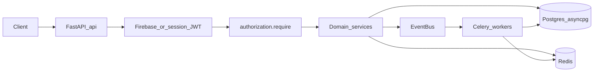

# Momentra Backend Architecture

Review document for the current backend under `backend/`. Reflects FastAPI + async SQLAlchemy + Celery as implemented today.

> **Platform shape is frozen.** Policy, ownership matrices, invite migration, and P0–P2 backlog live in [BACKEND_ARCHITECTURE_GOVERNANCE.md](BACKEND_ARCHITECTURE_GOVERNANCE.md). This file remains the descriptive map.

> **Note:** Older descriptions that mention PostgREST / `sb.table(...)` / `routers/personal.py` are obsolete. Postgres is accessed via SQLAlchemy asyncpg. Supabase is used primarily for **object storage** (`app/core/storage.py`), not as the API data layer.

---

## 1. Stack

| Layer | Choice |
|-------|--------|
| Runtime | Python ≥ 3.12 |
| HTTP API | FastAPI |
| ORM | SQLAlchemy 2.0 async + asyncpg |
| Migrations | Alembic (`mom_*` revisions; current head includes `mom_42_user_deleted_at`) |
| Auth | Firebase Admin (ID token) + app session JWT (`APP_SESSION_SECRET`) |
| Cache / broker | Redis (in-memory TTL fallback for cache when Redis unset) |
| Workers | Celery (queues: `refresh`, `delivery`, `media`, `maintenance`) + Beat |
| Schemas | Pydantic v2 |
| Reads (composed) | GraphQL (`app/api/graphql`) + application query use-cases |
| Deploy | Docker Compose (`api` + `worker` + `beat` + `redis`); Dokploy (`DOKPLOY.md`) |

---

## 2. Request flow



**CQRS-ish split**

- **REST** (`app/api/v1/*`) — commands / mutations and most resource endpoints
- **GraphQL** (`app/api/graphql` + `app/application/queries`) — composed reads (homes, pulse, life, memory)

**Startup (`app/main.py` lifespan)** registers moment-engine domains/handlers, personal quick-add handlers, template projection handlers, projection EventBus handlers, and event audit. Live DB connectivity is checked via `/health/ready`, not at process start.

---

## 3. Package map

| Area | Path | Role |
|------|------|------|
| Entry | `app/main.py` | App, lifespan, middleware, router mounts |
| REST | `app/api/v1/` | Thin routers → domain services |
| GraphQL | `app/api/graphql/` | Schema, HTTP transport, hardening |
| Application | `app/application/queries/` | Query use-cases for composed reads |
| Domains | `app/domains/*` | Models, repos, services, template handlers |
| Core | `app/core/` | Config, DB, Firebase, cache, observability, correlation |
| AuthN | `app/dependencies/`, `app/auth/` | Principal resolution |
| AuthZ | `app/authorization/` | Central `require(principal, action, resource)` |
| Security | `app/security/` | Headers, HTTP idempotency |
| Events | `app/shared/events/` | In-process EventBus, publisher, audit |
| Workers | `app/workers/` | Celery app + tasks |
| Tests | `app/tests/` (primary), `tests/` | Unit / acceptance / platform |
| Migrations | `alembic/versions/` | Schema evolution |
| Deploy | `Dockerfile`, `docker-compose.yml`, `scripts/` | api / worker / beat entrypoints |

---

## 4. API surface (mounted from `main.py`)

Almost all REST under `/api/v1`:

| Module | Notes |
|--------|--------|
| `auth`, `me`, `app` | Session, preferences, device tokens, app bootstrap / preferences |
| `reference_data`, `metadata` | Catalogs / bootstrap metadata |
| `invites` | Invite accept + related routes |
| `moments`, `my_money`, `personal` | Moments + personal / my-money |
| `group`, `group_app`, `group_read`, `group_shared`, `group_settlements`, `group_trips` | Group inventory, shared, trips/pulse, settlements |
| `business`, `business_app`, `business_active` | Workspaces, setup/invites, active moments |
| `circle`, `life360`, `memory` | Circle / Life360 / memory |
| `debug` | Debug-only helpers |
| `health` | **Root** `/health`, `/health/ready` (no `/api/v1` prefix) |
| GraphQL router | Prefix `""` — composed reads |
| `local_uploads` | Debug only when not production |

Optional: `/metrics` when metrics or debug enabled.

---

## 5. Domain inventory

| Domain | Owns |
|--------|------|
| **personal** | Personal finance moments, inventory, master expense, lifestyle / future_building / relationships / life_operations packages, quick-add, **template projection handlers** |
| **group** | Group moments, expenses, trips, shared living/purchase/experience, settlements, activity, projection read/cache, **template handlers** |
| **business** | Workspaces, setup (roles/invites), activity engine, life/memory, projection cache, vendor ledger, **templates** (ops / runway / team) |
| **moment_engine** | Cross-context lifecycle (`MomentEngine`), domain registry (PERSONAL / GROUP / BUSINESS / MY_MONEY), adapters, sync/Celery handlers |
| **moments** | Shared `moments` table models / repository / service + purge |
| **projections** | Personal projection service/cache/keys; EventBus invalidation → Celery refresh |
| **invites** | Legacy JWT/email invites + **opaque platform invites** (`platform_service.py`) |
| **users** | User models, repository, account service (incl. delete) |
| **auth** | Refresh-session ORM models |
| **app_bootstrap** | App empty-state / bootstrap service |
| **circle**, **life360**, **memory** | Circle feed, Life360 pipeline, memory models/services |
| **module_states**, **preferences** | Per-user module state + preferences |
| **reference_data** | Catalogs, expense taxonomy |
| **quick_add_contract** | Shared quick-add protocol / normalize / validate / hash |
| **notifications** | Thin package; delivery work lives in Celery tasks |
| **shared** | Cross-domain helpers (e.g. deferred side-effects) |

### Template registries

- **Personal:** `life_operations`, `future_building`, `lifestyle`, `relationships` (+ `shared_projection` helpers)
- **Group:** `shared_purchase`, `shared_living`, `shared_experience`
- **Business:** `TEAM_OPERATIONS`, `BUSINESS_RUNWAY`, `BUSINESS_OPERATIONS`

---

## 6. Cross-cutting patterns

1. **AuthN** — Firebase ID token first, else HS256 session JWT; map `firebase_uid` → internal user UUID (`app/dependencies/auth.py`).
2. **AuthZ** — Central `require(...)` with action vocabulary (`app/authorization/require.py`).
3. **MomentEngine** — Unified create / activate / archive across contexts; side effects via domain events + Celery.
4. **Template projections** — Moment-type builders for Pulse / Moments / Life / Memory / Activity; Redis-first caches with Celery rebuild.
5. **EventBus** — In-process invalidation and audit (`app/shared/events/`); async work on Celery.
6. **Platform invites** — Opaque codes in `PlatformInviteService` (`domains/invites/platform_service.py`, migration `mom_39`); coexists with legacy invite routes.
7. **Idempotency** — HTTP (`app/security/idempotency.py`) and worker (`app/workers/idempotency.py`).
8. **Observability** — Request / correlation IDs (`observability.py`, `correlation.py`); invalid header values are sanitized/replaced.
9. **Timestamps** — Many personal tables use `TIMESTAMP WITHOUT TIME ZONE`; write **naive UTC** (`datetime.now(timezone.utc).replace(tzinfo=None)`) when binding those columns.
10. **Postgres as source of truth** — Alembic migrations only; no Django ORM, no PostgREST API layer.

### Celery queues (`app/workers/celery_app.py`)

| Queue | Task prefixes |
|-------|----------------|
| `refresh` | `projections.*`, `snapshots.*`, `memory.*`, `analytics.*`, `orchestration.*` |
| `delivery` | `notifications.*` |
| `media` | `media.*` |
| `maintenance` | `cleanup.*` |

Beat: orchestration scan every 60s; nightly cleanup at 03:00 UTC.

---

## 7. File / folder structure

Meaningful tree only (not every leaf file).

```
backend/
├── app/
│   ├── main.py                 # FastAPI entry, middleware, routers
│   ├── api/
│   │   ├── v1/                 # REST routers
│   │   │   ├── auth.py
│   │   │   ├── me.py
│   │   │   ├── app.py
│   │   │   ├── personal.py
│   │   │   ├── my_money.py
│   │   │   ├── moments.py
│   │   │   ├── invites.py
│   │   │   ├── group.py
│   │   │   ├── group_app.py
│   │   │   ├── group_read.py
│   │   │   ├── group_shared.py
│   │   │   ├── group_settlements.py
│   │   │   ├── group_trips.py
│   │   │   ├── business.py
│   │   │   ├── business_app.py
│   │   │   ├── business_active.py
│   │   │   ├── circle.py
│   │   │   ├── life360.py
│   │   │   ├── memory.py
│   │   │   ├── reference_data.py
│   │   │   ├── metadata.py
│   │   │   ├── health.py
│   │   │   └── debug.py
│   │   ├── graphql/            # Schema, HTTP, APQ, authz hardening
│   │   └── local_uploads.py    # Dev upload stub
│   ├── application/
│   │   └── queries/            # GraphQL / composed-read use-cases
│   ├── auth/                   # Principal types
│   ├── authorization/          # require() + decision cache
│   ├── dependencies/           # Auth DI (get_current_user / principal)
│   ├── security/               # Headers, HTTP idempotency
│   ├── core/
│   │   ├── config.py
│   │   ├── database.py         # async engine, get_db
│   │   ├── base.py             # ORM registry import hub
│   │   ├── firebase.py
│   │   ├── security.py         # JWT session helpers
│   │   ├── cache.py
│   │   ├── storage.py          # Supabase Storage signed URLs
│   │   ├── observability.py
│   │   ├── correlation.py
│   │   ├── rate_limit.py
│   │   ├── metrics.py
│   │   ├── otel.py
│   │   └── …
│   ├── domains/
│   │   ├── personal/
│   │   │   ├── models.py / schemas / services
│   │   │   ├── life_operations/ future_building/ lifestyle/ relationships/
│   │   │   ├── master_expense/ quick_add/ projection/ activity/
│   │   │   └── templates/
│   │   │       ├── life_operations/ future_building/ lifestyle/ relationships/
│   │   │       └── shared_projection/
│   │   ├── group/
│   │   │   ├── models / services / access / trip_deep_service / …
│   │   │   ├── activity/ settlements/ experience_types/
│   │   │   └── templates/
│   │   │       ├── shared_purchase/
│   │   │       ├── shared_living/
│   │   │       └── shared_experience/
│   │   ├── business/
│   │   │   ├── models / app_service / active_service / vendor_*
│   │   │   ├── setup/          # adapters, invite_roles, member_roles
│   │   │   ├── activity/       # engine + per-template handlers
│   │   │   ├── projections/ life/ memory/ services/
│   │   │   └── templates/
│   │   │       ├── business_operations/
│   │   │       ├── business_runway/
│   │   │       └── team_operations/
│   │   ├── moment_engine/      # lifecycle, registry, handlers/
│   │   ├── moments/            # shared moment store + purge
│   │   ├── projections/        # cache, handlers, metrics
│   │   ├── invites/            # service.py + platform_service.py
│   │   ├── users/
│   │   ├── auth/               # refresh session models
│   │   ├── app_bootstrap/
│   │   ├── circle/ life360/ memory/
│   │   ├── module_states/ preferences/
│   │   ├── reference_data/
│   │   ├── quick_add_contract/
│   │   ├── notifications/      # placeholder package
│   │   └── shared/
│   ├── shared/
│   │   └── events/             # bus, publisher, audit, models
│   ├── workers/
│   │   ├── celery_app.py
│   │   ├── tasks/
│   │   │   ├── projections.py
│   │   │   ├── group_projections.py
│   │   │   ├── business_projections.py
│   │   │   ├── notifications.py
│   │   │   ├── memory.py snapshots.py analytics.py
│   │   │   ├── orchestration.py cleanup.py media.py
│   │   │   └── …
│   │   └── …                   # db, idempotency, instrumentation
│   ├── tests/                  # Primary suite (acceptance/, platform/, …)
│   └── utils/
├── alembic/
│   ├── env.py
│   └── versions/               # mom_01 … mom_42 (+ sql/ fixtures)
├── tests/                      # Extra domain unit tests (thin)
├── scripts/
│   ├── docker-entrypoint.sh
│   ├── docker-worker-entrypoint.sh
│   ├── dokploy-*.js|ps1        # Deploy helpers
│   └── load_test_*.py / benches
├── Dockerfile
├── docker-compose.yml          # api + worker + beat + redis
├── docker-compose.test.yml
├── alembic.ini
├── pyproject.toml
├── requirements.txt
├── Makefile
├── DOKPLOY.md
├── README.md                   # Runbook / setup
└── docs/
    ├── BACKEND_ARCHITECTURE.md           # This document (descriptive map)
    └── BACKEND_ARCHITECTURE_GOVERNANCE.md # Frozen rules, matrices, backlog
```

---

## 8. Deploy shape

```
docker-compose.yml
  api     → uvicorn (port 8000); entrypoint may run `alembic upgrade head`
  worker  → celery worker (multi-queue)
  beat    → celery beat
  redis   → broker + cache
```

Postgres is external (`DATABASE_URL`). Production compose is typically managed via Dokploy (`scripts/dokploy-*`, `DOKPLOY.md`). Health: `GET /health`, readiness: `GET /health/ready`.

---

## 9. Related docs

- [BACKEND_ARCHITECTURE_GOVERNANCE.md](BACKEND_ARCHITECTURE_GOVERNANCE.md) — frozen rules, ownership matrices, invite migration, risks, backlog
- [backend/README.md](../README.md) — local setup, env vars, day-to-day commands
- [backend/DOKPLOY.md](../DOKPLOY.md) — production deploy on Dokploy
